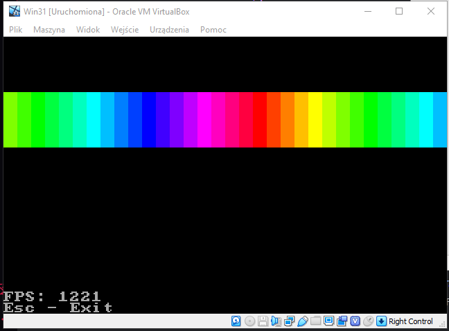

Example Codes involving DOS programming in C89.

I use Microsoft C 7.0 on a Windows 3.1 VM instead of Turbo C 3.0 or Borland C 3.1 because it's closer to the future versions of C.

## BMP Demo
BMPDEMO, BMPDEMO2, BMPDEMO3 are for Turbo C/Borland C.

BMPDEMO4 is for Microsoft C 7.0 including custom `gotoxy()`.

## GBC-Like

**GBCLIKE** is a demonstration on how to render like Nintendo's GameBoy Classic with the screen centred.

**RIZZLER** is based on **GBCLIKE**, which demonstrates loading an indexed bitmap & drawing a C-string.

The lyric video: [Sticking Out Your Gyat For the Rizzler - (Official Lyric Video)](https://www.youtube.com/watch?v=eJoViV5T1g0)
